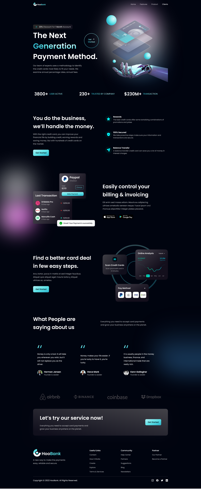

# 💳 HooBank UI

A modern, responsive banking user interface built with React, Vite, and Tailwind CSS.



## 🚀 Quick Overview

HooBank UI is a cutting-edge front-end application designed to provide a sleek and intuitive banking interface. Leveraging the latest web technologies, it offers a responsive and modern design that enhances user experience.

## 🔗 Repository

[GitHub Repository](https://github.com/AvishkaGihan/hoobank-ui.git)

## ✨ Features

- 🎨 Modern, responsive design
- 💨 Built with Vite for lightning-fast development
- 🌈 Styled with Tailwind CSS
- ⚛️ Developed using React
- 📱 Fully responsive layout

## 📦 Project Structure

```
hoobank-ui/
├── public/
│   ├── favicon.ico
│   ├── logo.svg
│   └── robots.txt
│
└── src/
    ├── assets/
    │   ├── icons/
    │   └── images/
    │
    ├── components/
    │   ├── Navbar.jsx
    │   ├── Hero.jsx
    │   ├── Stats.jsx
    │   ├── Business.jsx
    │   ├── Billing.jsx
    │   ├── CardDeal.jsx
    │   ├── Testimonials.jsx
    │   ├── Clients.jsx
    │   └── CTA.jsx
    │
    ├── constants/
    │   ├── index.js
    │
    ├── App.jsx
    └── main.jsx
```

## 🛠 Installation & Setup

1. Clone the repository

```bash
git clone https://github.com/AvishkaGihan/hoobank-ui.git
```

2. Install dependencies

```bash
cd hoobank-ui
npm install
```

3. Start the development server

```bash
npm run dev
```

## 🚦 Available Scripts

| Command           | Description              |
| ----------------- | ------------------------ |
| `npm run dev`     | Start development server |
| `npm run build`   | Build for production     |
| `npm run preview` | Preview production build |
| `npm run lint`    | Run ESLint               |

## 📚 Key Dependencies

- React 18
- Vite
- Tailwind CSS
- ESLint

## 🤝 Contributing

Contributions are welcome! Please feel free to submit a Pull Request.

## 📄 License

This project is licensed under the MIT License.

---

**Made with ❤️ by Avishka Gihan**
